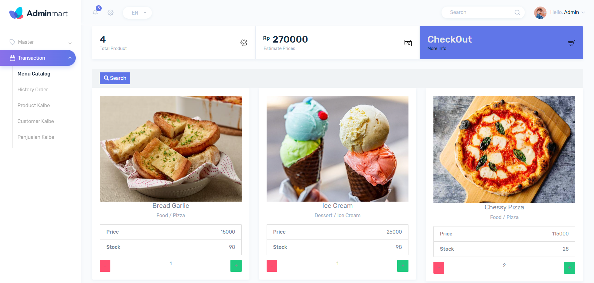
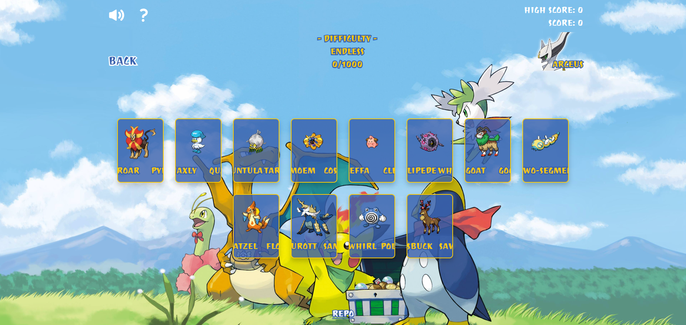

## Hi there 👋

<h2 align="center">Hello, <a href="https://github.com/Andmana" 
  title="Profile">I'm Andreas</a>👋</h2>
 

  <bold>I'm a Full Stack Developer</bold> 
  👀 I’m looking for a job opportunity in web development  
  📫 How to reach me: <i>andreas.pputras@gmail.com</i>  
  
  

 

<h1 align="center">🚀 Languages & Tools</h1>

<h3 align='center'>🏝️ Languages</h3>

<table align="center">
  <tr>
    <td align="center" height="75" width="75">
      
       JavaScript
    </td>
    <td align="center" height="75" width="75">
      
       TypeScript
    </td>
    <td align="center" height="75" width="75">
      
       PHP
    </td>
  </tr>
  <tr>
    <td align="center" height="75" width="75">
      
       Python
    </td>
    <td align="center" height="75" width="75">
      
       Java
    </td>
    <td align="center" height="75" width="75">
      
       C#
    </td>
  </tr>
</table>

<table align="center">
  <tr>
    <td align="center" height="75" width="75">
      
       SQL Server
    </td>
    <td align="center" height="75" width="75">
      
       MySQL
    </td>
    <td align="center" height="75" width="75">
      
       PostgreSQL
    </td>
  </tr>
</table>

<table align="center">
  <tr>
    <td align="center" height="75" width="75">
      
       HTML5
    </td>
    <td align="center" height="75" width="75">
      
       CSS3
    </td>
  </tr>
</table>

<h3 align='center'>🧰 Frameworks</h3>

<table align="center">
  <tr>
    <td align="center" height="75" width="75">
      
       React JS
    </td>
    <td align="center" height="75" width="75">
      
       Vue JS
    </td>
    <td align="center" height="75" width="75">
      
       Next JS
    </td>
    <td align="center" height="75" width="75">
      
       Angular
    </td>
  </tr>
</table>

<table align="center">
    <td align="center" height="75" width="75">
      
       .NET
    </td>
    <td align="center" height="75" width="75">
      
       Spring Boot
    </td>
    <td align="center" height="75" width="75">
      
       Laravel
    </td>
    <td align="center" height="75" width="75">
      
       Codeigniter
    </td>
    <td align="center" height="75" width="75">
      
       Node JS
    </td>
</table>

<table align="center">
    <td align="center" height="75" width="75">
      
       Bootstrap
    </td>
    <td align="center" height="75" width="75">
      
       Tailwind CSS
    </td>
</table>

<h1 align="center">Projects</h1>

<table>
  <tr>
    <!-- <td width='50%'></td> -->
     <td width='50%' colspan=2>
      <h2 align='center'>Game Harbor</h2>
      
  
        
         
         
        

          <a href='https://github.com/Andmana/Game-Station' >
            <strong>REPO</strong>
          </a> 
          <a href='https://game-station-xxx.netlify.app/'>
            <strong>LIVE</strong>
          </a>
        

        
<strong>React, TypeScript, Tailwind CSS</strong>

      

    </td>
  </tr>
  <tr>
    <td width='50%'>
      <h2 align='center'>Point of Sale</h2>
      
  
        
         
         
        

          <a href='https://github.com/Andmana/.NET-POS'>
            <strong>REPO</strong>
          </a>
        

        
<strong>.NET, C#, Microsoft SQL Server, Bootstrap</strong>

      

    </td>
    <td width='50%'>
      <h2 align='center'>PokéCard</h2>
      
  
        
         
         
        

          <a href='https://github.com/Andmana/Memory-App'>
            <strong>REPO</strong>
          </a>
          <a href='https://memory-app-andmana.netlify.app/'>
            <strong>LIVE</strong>
          </a>
        

        
<strong>React, JavaScript, HTML, CSS</strong>

      

    </td>
  </tr>
</table>
